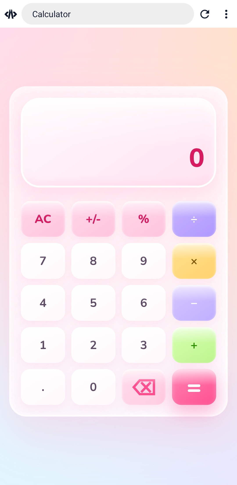

## ⚡ Calculator

A modern calculator built with HTML, CSS, and JavaScript featuring a soft pastel glassmorphism UI.

## ✨ Features
- Basic arithmetic operations
- Decimal calculations
- Percentage (%)
- Positive/Negative toggle (+/-)
- Backspace
- Responsive design
- Animated glassmorphism interface

## 🚀 Technologies Used
- HTML5
- CSS3
- JavaScript (Vanilla)

## 📸 Project Showcase




## 🌐 Live Demo

(Add GitHub Pages link here)

## 📂 Project Structure 

```
Glassmorphism-Calculator/
│── index.html
│── style.css
│── script.js
│── calculator-preview.jpg
│── README.md
```

## 👩🏻‍💻 Author

Sayantani Sikdar

## 🪪 License 
This project is licensed under the MIT License.
